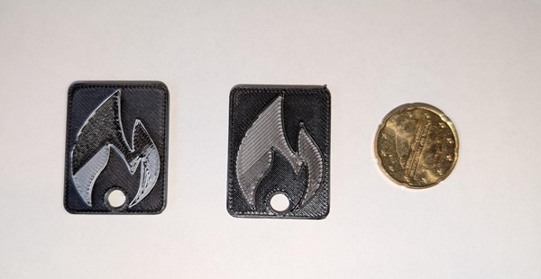

# Maester assets

## Keychain

You can find a keychain in the `maester_keychain.stl` file. For the best look, I would switch filament right before you're at the logo layer. And if you want you can also add a small NFC sticker if you pause at layer 4 (with 0.2mm layer height).

Designed by [@svrooij](https://svrooij.io/).

## Logo

You can find the regular logo in the `maester_logo.svg` file.

### Logo outline

You can find the logo outline in the `maester_logo_outline.svg` file. This is a simple outline of the logo, which you can use to cut out a sticker or something similar. This is also accepted by many 3d modeling applications. And is also used on the keychain.
